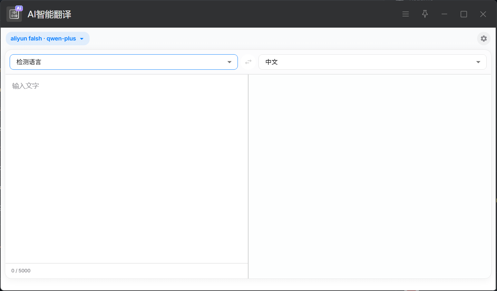

# AI 智能翻译

一个优雅、快速、现代的 AI 翻译 uTools 插件，支持多种 AI 翻译服务。



## 特性

- **现代 UI 设计** - 基于 Material-UI 的 Apple 风格界面
- **多 AI 服务支持** - 兼容 OpenAI、Qwen、DeepSeek 等多种 AI 服务
- **智能语言检测** - 自动识别 8+ 种语言，智能切换翻译方向
- **模型切换** - 可在界面上快速切换不同的 AI 模型
- **紧凑设计** - 优化的界面布局，节省屏幕空间

## 安装与构建

本项目基于 Node.js 环境开发。

### 1\. 环境依赖

  - Node.js (LTS)
  - pnpm

### 2\. 获取代码与安装

```bash
git clone https://github.com/NiceAsiv/AI_translation_for_uTools.git
cd AI_translation_for_Utools
pnpm install
```

### 3\. 开发模式

```bash
pnpm run dev
```

启动本地开发服务器（默认端口 5173）。

### 4\. 构建插件

```bash
pnpm run build
```

构建产物将输出至 `dist/` 目录。
在 uTools 开发者工具中，选择 `dist/plugin.json` 即可加载并测试插件。

## 配置指南

插件安装后，需配置 LLM 服务商信息方可使用。

1.  **进入设置**：在插件界面输入 `翻译设置` 或点击设置图标。
2.  **添加服务**：
      * **API Key**: 服务商提供的密钥。
      * **Base URL**: API 接口地址（例如 `https://dashscope.aliyuncs.com/compatible-mode/v1`）。
      * **Model**: 模型名称（例如 `qwen-plus`）。
3.  **激活**：在列表中选中目标服务。

> **推荐配置**：
> 阿里云 Qwen 模型（速度与成本平衡较好）。
>
>   * 模型：`qwen-plus` 或 `qwen-mt-flash`
>   * 获取 Key：[阿里云百炼控制台](https://bailian.console.aliyun.com/)

## 使用方式

  - **划词翻译**：选中文本 -\> 呼出 uTools 超级面板 -\> 选择“AI 智能翻译”。
  - **命令调用**：输入 `翻译`、`翻译成英文`、`翻译成中文`、`translate` 或 `fy` 唤起插件。

## 技术栈

  - **Core**: React 19, Vite 6
  - **UI**: Material-UI v7, Tailwind CSS v3
  - **Icons**: Lucide React, Material Icons
  - **Fonts**: Inter, Noto Sans SC

## 项目结构

```bash
.
├── public/
│   ├── plugin.json          # uTools 插件描述文件
│   └── preload/
│       └── services.js      # Electron/Node.js 后端逻辑
├── src/
│   ├── Settings/            # 设置模块
│   ├── Translate/           # 核心翻译模块
│   ├── App.jsx              # 路由入口
│   └── theme.js             # 主题配置
└── vite.config.js           # 构建配置
```

## 协议

MIT License
